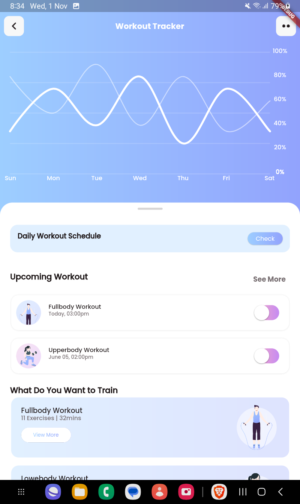
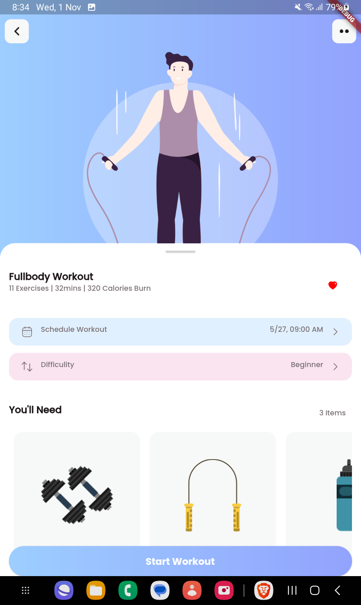
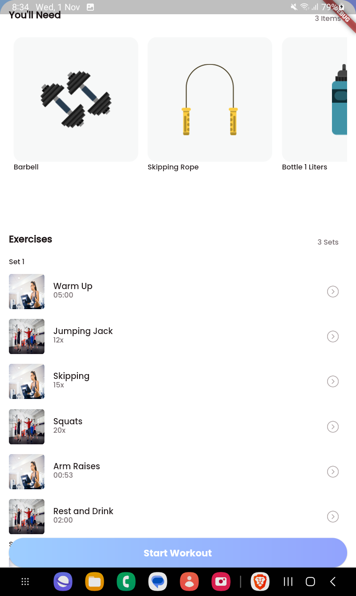
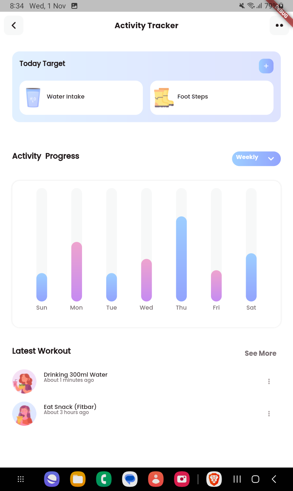
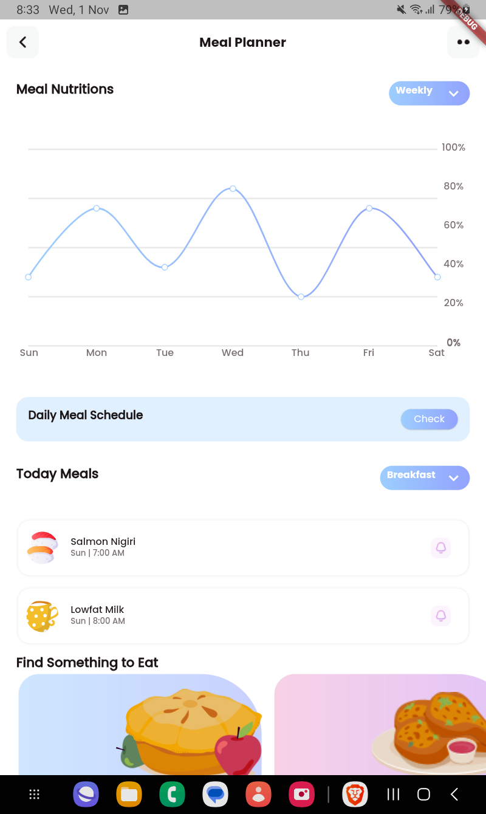
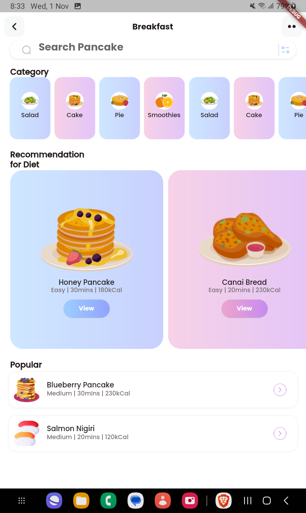
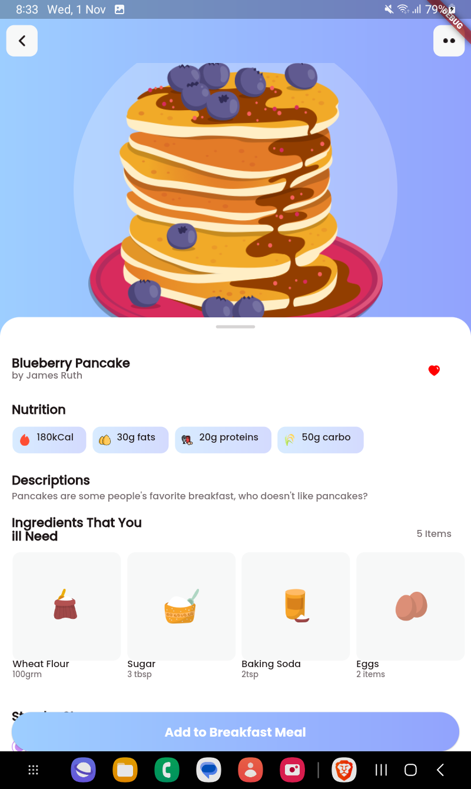
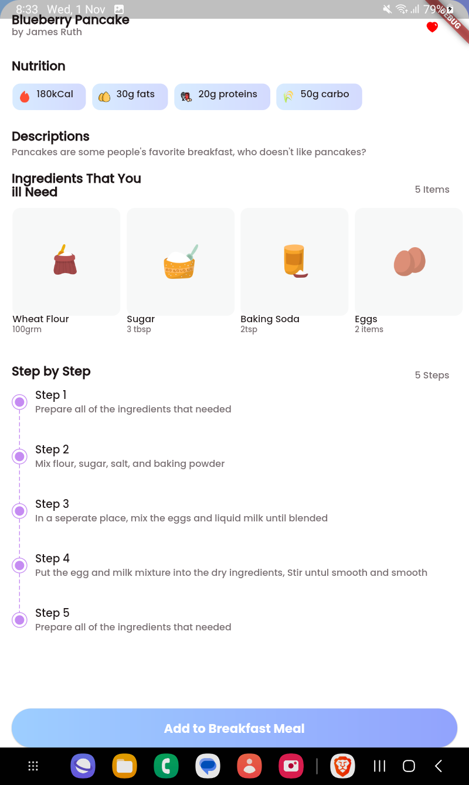
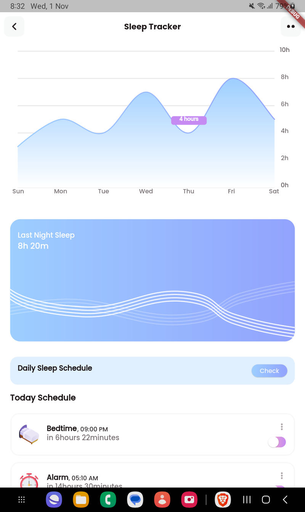
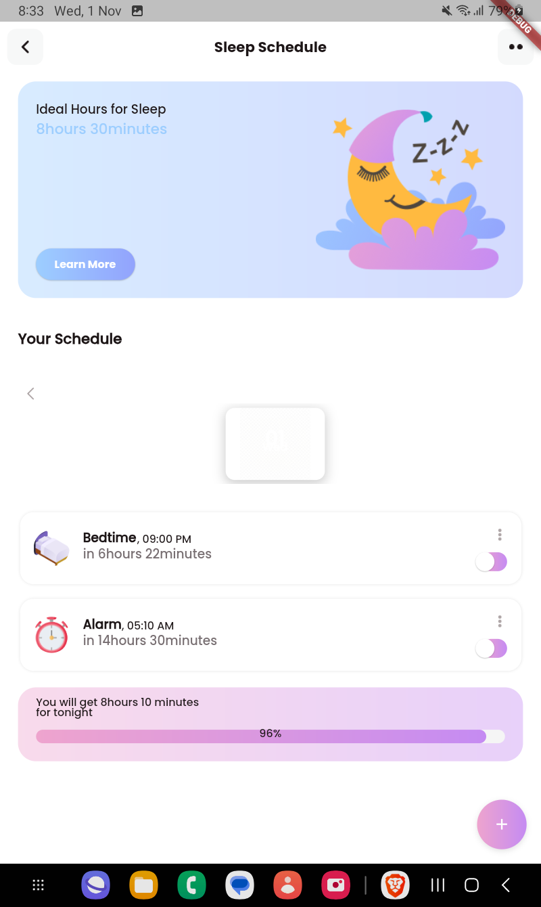

# Fitbuddy - Your All-in-One Well-Being Solution

Welcome to Fitbuddy, the app dedicated to enhancing your physical, mental, and social well-being. Fitbuddy offers a comprehensive suite of features designed to help you live a healthier and more fulfilling life.

## Table of Contents

1. [Introduction](#introduction)
2. [Features](#features)
3. [Screenshots](#screenshots)
4. [Getting Started](#getting-started)
5. [Usage](#usage)
6. [Contributing](#contributing)
7. [License](#license)

## Introduction

Fitbuddy is your virtual fitness and well-being companion. We understand the importance of maintaining a healthy lifestyle, which includes both physical and mental well-being. With Fitbuddy, you can easily access workouts, track your meals, and stay hydrated, all in one convenient app.

## Features

Fitbuddy offers a range of features to support your well-being:

- **Workouts:** Access a library of workouts tailored to your fitness level and goals. Stay active and maintain a healthier physique.

- **Meal Tracking:** Keep a record of your meals and nutritional intake. Make informed choices to improve your dietary habits.

- **Sleep Tracking:** Ensure a restful night's sleep with our sleep tracking feature. Monitor and analyze your sleep patterns, receive insights into your sleep quality, and set personalized sleep goals. Proper sleep is essential for overall well-being.

## Screenshots

### Workout

<table>
<tr>
 <td>  
 <td> 
 <td>  
 <td>  
</tr>
</table>

### Meal 
<table>
<tr>
 <td> 
 <td>  
 <td>  
 <td>  
</tr>
</table>

### sleep

<table>

<tr>
    <td> 
    <td> 
</tr>
</table>

## Getting Started

To get started with Fitbuddy, follow these steps:

1. Clone this repository to your local machine.
2. Install the app on your device.
4. Explore the various features and get on your journey towards a healthier you.

## Usage

Fitbuddy is designed to be user-friendly, but if you have any questions or need assistance, don't hesitate to reach out to this mail deepeshkalurs@gmail.com.

## Contributing

We welcome contributions from the community to make Fitbuddy even better. If you'd like to contribute to the development of this app, please follow our [contribution guidelines](CONTRIBUTING.md).

## License

Fitbuddy is licensed under the [MIT License](LICENSE). You are free to use, modify, and distribute this software, subject to the terms of the license.

Thank you for choosing Fitbuddy to support your well-being journey! We are committed to helping you live a healthier, happier life. If you have any feedback, suggestions, or bug reports, please feel free to reach out to us at deepeshkalurs@gmail.com

Enjoy your journey to physical and mental well-being with Fitbuddy!
